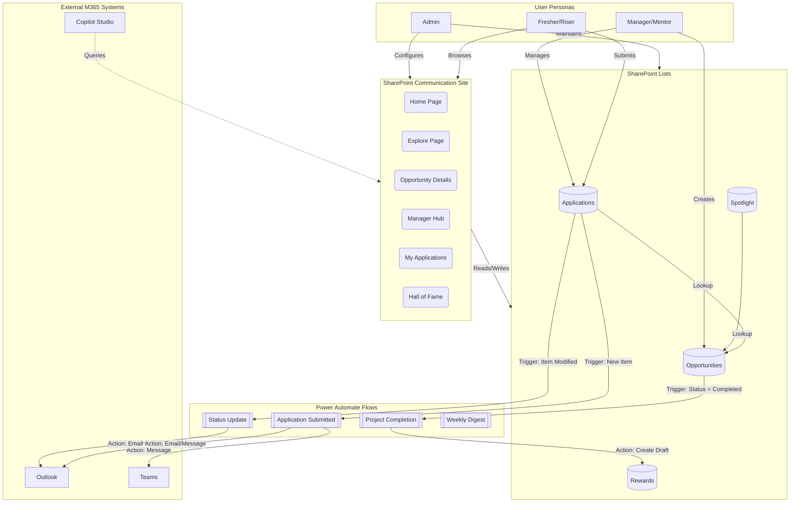

# Architecture Overview

## Architecture Diagram

## Maintenance Guide

**No code to maintain. Zero-code architecture. Maintenance = only add List items. Flows self-heal.**

### Philosophy
The SPARK platform is built strictly using out-of-the-box Microsoft 365 capabilities. There is absolutely no custom server-side code (C#), no custom front-end frameworks (React/Angular), and no SPFx web parts to compile, update, or maintain.

### Routine Maintenance
- **Content Updates**: All dynamic content on the site is driven by SharePoint Lists. To update the site, simply add, edit, or delete items in the underlying Lists (`Opportunities`, `Spotlight`, etc.).
- **Permissions**: Managed via standard SharePoint Groups (Owners, Members, Visitors).
- **Flow Resiliency**: Power Automate flows are designed to be idempotent and self-healing. If a flow fails due to a temporary service disruption, it can be resubmitted via the Power Automate run history portal. Connections use service accounts or shared connections.
